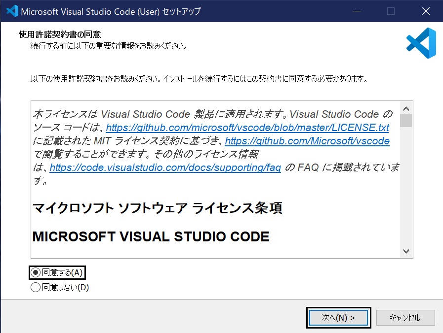
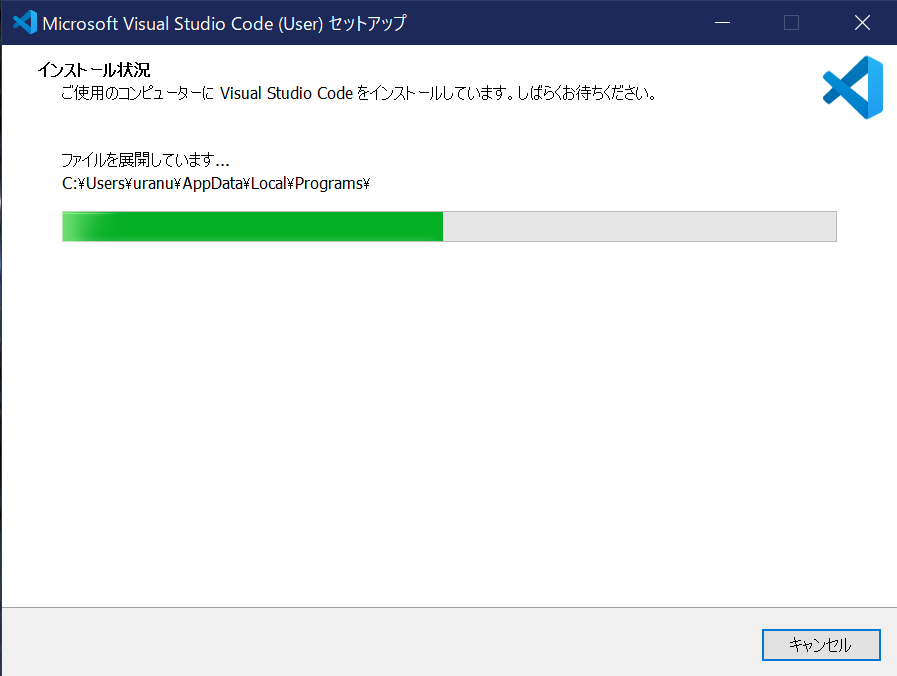
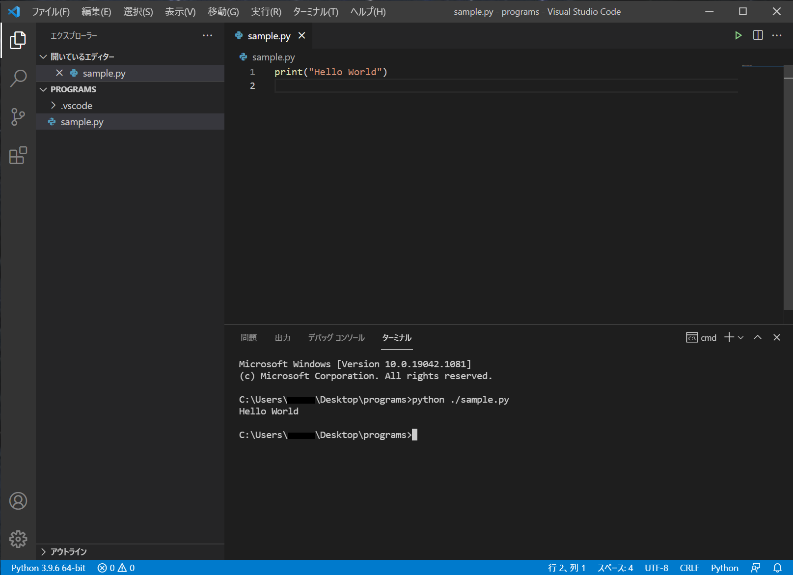

# step 0

## Pythonの環境構築 (Windows10)

### Pythonのインストール

まず、Pythonのインストールについて解説します  
以下のリンクから公式サイトにアクセスして下さい  
  
[Python公式サイト](https://www.python.org)  
  
画面上部の「Downloads」にカーソルを合わせると下の画像の様なメニューが表示されます  
表示されたメニューの左側にある「Python 3.9.6」と書かれたボタンをクリックして下さい  
最新バージョンのPythonのインストーラーがダウンロードされます  
(数字は異なる場合があります)  
  
  
  
次にダウンロードしたファイルを起動してください  
以下の画像の様なウィンドウが表示されるので「Add Python 3.9 to PATH」にチェックを入れて「Install Now」クリックして下さい  
  
  
  
インストールが始まります
  
  
  
終了したら「Close」をクリックしてください  

  

最後にPythonがインストールされているか確認します  
タスクバー左下の検索アイコンをクリックして、「cmd」と入力して下さい  
  
  
  
「開く」をクリックしてコマンドプロンプトを起動して下さい  
以下のコマンドを入力して下さい  

```
python -V
```

インストールが成功していれば以下の画像の様にバージョンが表示されます  
  
  


### VSCodeのインストール

次にVSCodeのインストールについて解説します  
VSCode (Visual Studio Code)とは、マイクロソフトが無料で提供している軽量なコードエディタのことです  
今回はこれを使ってコードを書いていきます  
以下のリンクからVSCodeの公式サイトにアクセスしてください  

[VSCode公式サイト](https://code.visualstudio.com)  

画面の「Download for Windows」をクリックしてください  
VSCodeのインストーラがダウンロードされます  

  

次にダウンロードしたファイルを起動してください  
以下の画像の様なウィンドウが表示されるので使用許諾契約書を読み、「同意する」にチェックを入れて「次へ」をクリックして下さい  
  
  
  
次にインストール先を変えることができるウィンドウになりますが、特に変える必要がないので「次へ」をクリックして下さい  


次にスタートメニューフォルダを変えることができるウィンドウになりますが、これも特に変える必要がないので「次へ」をクリックして下さい  


次に追加タスクを選択できるウィンドウになります  
全てのチェックボックスにチェックを入れ、「次へ」をクリックして下さい  


次に今までの設定の確認を行う画面になるので「次へ」をクリックして下さい  


インストールが始まります  



終了したら「完了」をクリックしてください  


以下のようなウィンドウが開いたらインストール成功です  


### VSCode日本語化
VSCodeを日本語化する方法について解説します  
まず左のメニュー欄から「Extensions(拡張機能)」を選択して、検索欄に「japanese」と入力して下さい  
一番上に出てくる「Japanese Language Pack for Visual Studio Code」を選択して「Install」をクリックして下さい  


インストールが終わると右下にホップアップが現れ、「Restart」というボタンがあるのでクリックして下さい  


もう一回VSCodeが起動するので、以下のように日本語になっていたらインストールは成功です  


### Python拡張機能
インストールの方法は「Japanese Language Pack for Visual Studio Code」と同じです  
左のメニューから拡張機能を選択し、検索欄に「python」と入力して下さい  
一番上に出てくる「Python」を選択し「Install」をクリックして下さい  


インストールに成功すると以下の様な画面になります  


## プログラムの書き方

### ソースファイルの作成
デスクトップにフォルダーを作成します  
例として、フォルダー名は「programs」とします  
  
  
  
  
  
VSCodeからフォルダーを開きます  
左上の「ファイル」を選択して、「フォルダーを開く」をクリックして下さい  
  

  

  
デスクトップから作成したフォルダーを選択して開いてください  
以下のような表示が出た時は、「はい、作成者を信頼します」をクリックして下さい  
  

  
フォルダー名の右にカーソルを合わせて「新しいファイル」を選択し、ファイルを作成して下さい  


例として、ファイル名は「sample.py」とし、中身は以下のようにします  
   
```python
# sample.py
print("Hello World")

```

### プログラムの実行

右上の実行ボタンをクリックしてプログラムを実行します  


またはターミナルに、以下のように入力して実行します  
ターミナルは Ctrl + Shift + @で出すことができます  

```
pyhton ./sample.py
```
  

