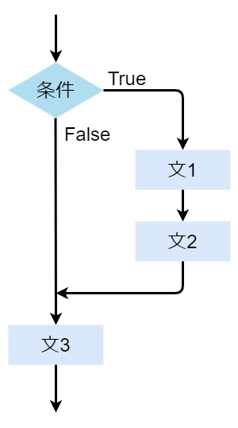
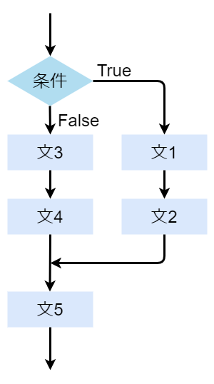
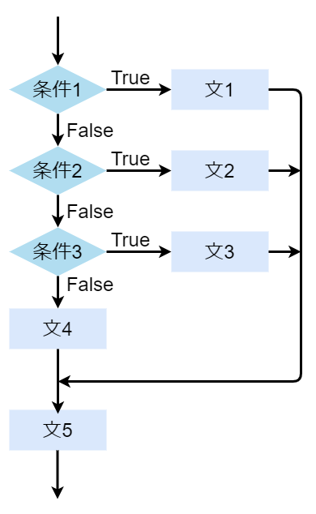
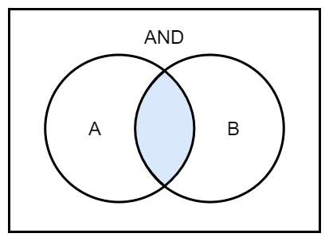
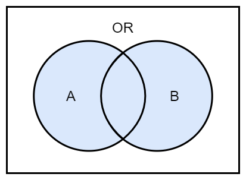
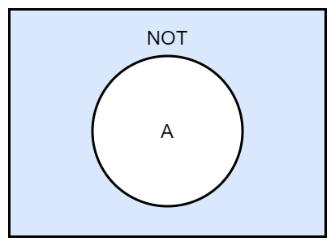

# step 4

## 状況に応じた処理

Pythonではさまざまな状況を表すために条件(condition)という概念があります  
条件にはTrue(正しい)とFalse(正しくない)の二つの値があります  
条件は比較演算子(comparison operator)を使用して書くことができます  
比較演算子を評価するとTrueかFalseの値になります  
比較演算子の種類を以下に示します  

| 記号 | 例 | 意味 |
| --- | --- | --- |
| == | A == B | AとBが等しいとTrue |
| != | A != B | AとBが等しくないとTrue |
| > | A > B | AがBより大きいとTrue |
| >= | A >= B | AがB以上だとTrue |
| < | A < B | AがB未満だとTrue |
| <= | A <= B | AがB以下だとTrue |
| in | A in B | AにBが存在するとTrue |
| not in | A not in B | AにBが存在しないとTrue |
| is | A is B | AとBが同一だとTrue |
| is not | A is not B | AとBが同一ではないとTrue |

比較演算子は今までの演算子より優先順位は低いです  
実際に条件に応じて処理を書くにはif文(if statement)を用います  
if文のような条件に応じた処理をする文を条件判断文(conditional statement)といいます  
if文は「:」(コロン)の次の行から続く字下げされた部分を順に実行します  

```python
if 条件:
    文1
    文2
    ...
文3
```



この字下げをインデント(indent)と呼びます  
インデントはスペース何文字でもいいですが、字下げした最初の行に先頭を揃えて字下げすることが必要になります  
インデントされた行の集まりはブロック(block)と呼ばれます  
if文は条件がTrueのときにブロックの中の処理を実行します  

```python
# sample_01.py
if 5 > 2:  # 5 > 2 は5が2より大きいためTrueとなります
    print("5 > 2 は正しいです")  # 条件がTrueのため実行されます

if 5 < 2:  # 5 < 2 は5が2より小さくないためFalseとなります
    print("5 < 2 は正しいです")  # 条件がFalseのため実行されません
```

```text
5 > 2 は正しいです
```

## その他の処理

Pythonではif文にあわせて、条件がFalseだった時に実行する処理を記述できます  
これらは合わせてif-else文(if else statement)と呼ばれます  

```python
if 条件:
    文1
    文2
    ...
else:
    文3
    文4
    ...
文5
```



条件は必ずTrueかFalseになるため、必ずifかelseかどちらか一つのブロック内の処理を実行します  
elseに条件は記述しません  

```python
# sample_02.py
if 5 > 2:  # 5 > 2 は5が2より大きいためTrueとなります
    print("5 > 2 は正しいです")  # 条件がTrueのため実行されます
else:  # 条件がFalseではないのでelseのブロックが実行されません
    print("5 > 2 は正しくありません")  # 条件がFalseのため実行されません

if 5 < 2:  # 5 < 2 は5が2より小さくないためFalseとなります
    print("5 < 2 は正しいです")  # 条件がFalseのため実行されません
else:  # 条件がFalseのためelseのブロックが実行されます
    print("5 < 2 は正しくありません")  # 条件がFalseのため実行されます
```

```text
5 > 2 は正しいです
5 < 2 は正しくありません
```

## 条件を増やすには

二つ以上の条件のどれに当てはまるのかによって処理を変えたいときはif, elif, elseを組み合わせて使用します  
elifにはifと同じように条件を記述します  
またelifは複数記述することが出来ます  

```python
if 条件1:
    文1
    ...
elif 条件2:
    文2
    ...
elif 条件3:
    文3
    ...
else:
    文4
    ...
文5
```



```python
# sample_03.py
num = int(input("数字を入力してください :"))
print("変数numは", num, "です")

if num < 5:  # num < 5がTrueのときに実行されます
    print("変数numは5より小さいです")
elif num < 10:  # num < 5 がFalseかつ num < 10 がTrueのときに実行されます
    print("変数numは5より小さくありません")
    print("変数numは10より小さいです")
elif num < 15:  # num < 5, num < 10 がFalseかつ num < 15 がTrueのときに実行されます
    print("変数numは10より小さくありません")
    print("変数numは15より小さいです")
else:  # 全ての条件がFalseのときに実行されます
    print("変数numは15より小さくありません")
```

```text
数字を入力してください :12
変数numは 12 です
変数numは10より小さくありません
変数numは15より小さいです
```

## 複雑な条件

複数の条件を組み合わせて、より複雑な条件を表すときに使われる演算子を論理演算子(Logical operator)と言います  
論理演算子の種類を以下に示します  

| 記号 | 例 | 意味 |
| --- | --- | --- |
| and | A and B | AがTrueかつBがTrueのときにTrue |
| or | A or B | AがTrueまたはBがTrueのときにTrue |
| not | not A | AがTrueではないときにTrue |





論理演算子は条件演算子より優先順位は低いです  

```python
# sample_04.py
num = int(input("数字を入力してください :"))
print("変数numは", num, "です")

if num > 5 and num < 10:  # num > 5 がTrueかつ num < 10 がTrueのときに実行されます
    print("変数numは5より大きく10より小さいです")

if num == 5 or num == 10:  # num == 5 がTrueまたは num == 10 がTrueのときに実行されます
    print("変数numは5または10に等しいです")

if not num < 10:  # num < 10 がTrueではないときに実行されます
    print("変数numは10より小さくありません")
```

```text
数字を入力してください :7
変数numは 7 です
変数numは5より大きく10より小さいです
```

```text
数字を入力してください :5
変数numは 5 です
変数numは5または10に等しいです
```

```text
数字を入力してください :12
変数numは 12 です
変数numは10より小さくありません
```

## 三項演算子

簡単な条件判断には演算子となっている if else を使うことができます  
if else は条件演算子(conditional operator)と呼ばれます  
またオペランドを三つとる三項演算子でもあります  
Trueの時の値 if 条件 else Falseの時の値 という書き方をします  

```python
# sample_05.py
num1 = 12
num2 = 4
print(num1, "と", num2, "では", num1 if num1 > num2 else num2, "のほうが大きいです")
```

```text
12 と 4 では 12 のほうが大きいです
```
