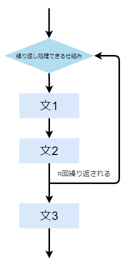
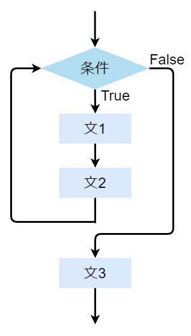
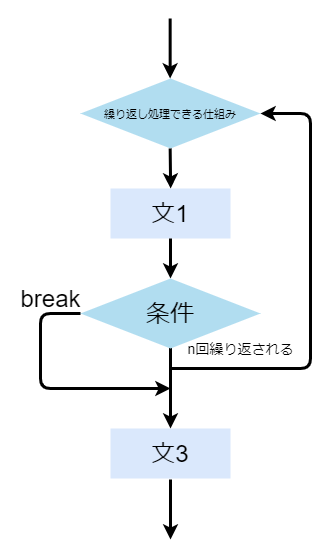
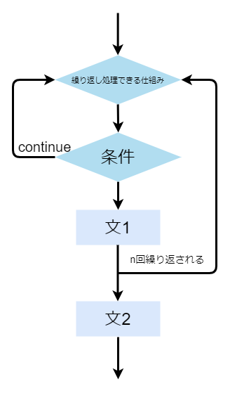

# step 5

## 回数の繰り返し文

Pythonで繰り返し同じ処理をするときは繰り返し文(loop statement)を用います  
Pythonに繰り返し文は複数ありますが、for文(for statement)からはじめます  

```python
for 変数 in 繰り返し処理できる仕組み:
    文1
    文2
    ...
文3
```



for文にはたくさんのデータの列のような繰り返し反復して処理できる仕組みを```in```の後に指定する必要があります  
ここでは`range()`を使ってみます  
`range(回数)`とすることで0から回数分の数字の列を得ることができます  

```python
# sample_01.py
for i in range(5):  # 5回繰り返します
    print("変数iは", i, "です")  # 0から5回分の数字を表示します
```

```text
変数iは 0 です
変数iは 1 です
変数iは 2 です
変数iは 3 です
変数iは 4 です
```

## 回数の指定の種類

`range(回数)`というものは`range(開始値, 停止値, 間隔)`という記述を簡略化したものです  
開始値を省略すると0、間隔を省略すると1となります  
これらを指定すればさまざまな繰り返し処理を記述できます  

```python
# sample_02.py
print("range(1, 12, 1)")
for i in range(1, 12, 1):  # 1から12まで1つずつ繰り返します
    print("変数iは", i, "です")

print("range(2, 10, 2)")
for i in range(2, 10, 2):  # 2から10まで2つずつ繰り返します
    print("変数iは", i, "です")

print("range(12, 1, -1)")
for i in range(12, 1, -1):  # 間隔にはマイナスの値を指定することもできます
    print("変数iは", i, "です")
```

```text
range(1, 12, 1)
変数iは 1 です
変数iは 2 です
変数iは 3 です
変数iは 4 です
変数iは 5 です
変数iは 6 です
変数iは 7 です
変数iは 8 です
変数iは 9 です
変数iは 10 です
変数iは 11 です
range(2, 10, 2)
変数iは 2 です
変数iは 4 です
変数iは 6 です
変数iは 8 です
range(12, 1, -1)
変数iは 12 です
変数iは 11 です
変数iは 10 です
変数iは 9 です
変数iは 8 です
変数iは 7 です
変数iは 6 です
変数iは 5 です
変数iは 4 です
変数iは 3 です
変数iは 2 です
```

## 条件の繰り返し文

Pythonでは条件によって繰り返す事もできます  
このときに用いるのがwhile文(while statement)です  

```python
while 条件:
    文1
    文2
    ...
文3
```



while文は条件が`True`である限りブロック内を何回でも繰り返すことが可能です  

```python
# sample_03.py
i = 1  # 条件で使う変数です
while i < 10:  # i < 10がTrueのときに繰り返されます
    print("変数iは", i, "です")
    i += 1  # 条件がFalseになるように1ずつ増やします
```

```text
変数iは 1 です
変数iは 2 です
変数iは 3 です
変数iは 4 です
変数iは 5 です
変数iは 6 です
変数iは 7 です
変数iは 8 です
変数iは 9 です
```

## for文のネスト

for文の中にもfor文を書くことができます  
このことを入れ子にする、またはネストすると言います  
また、内側のループの回数を変数で指定することもできます  
if文やwhile文等も同様にネストすることができます  

```python
# sample_04.py
for i in range(10):  # 外側のループは10回繰り返します
    for j in range(i + 1):  # 内側のループはi + 1回繰り返します
        print("[]", end="")  # []を表示します
    print()  # 改行します
```

```text
[]
[][]
[][][]
[][][][]
[][][][][]
[][][][][][]
[][][][][][][]
[][][][][][][][]
[][][][][][][][][]
[][][][][][][][][][]
```

`print`内の`end`は末尾に出力するものを指定する引数です  
(引数についてはstep10で解説します)  
標準では`\n`改行が指定されています  

## if文との組み合わせ

if, elif, else文やwhile文等もfor文の中に書くことができます  

```python
# sample_05.py
v = 0
for i in range(10):  # 外側のループは10回繰り返されます
    for j in range(21):  # 内側のループは21回繰り返されます
        if v == 0:  # vが0のときに実行されます
            print("*", end="")  # アスタリスクを表示します
            v = 1  # 1を代入します
        elif v == 1:  # vが1のときに実行されます
            print("-", end="")  # マイナスを表示します
            v = 0  # 0を代入します
    print()  # 改行します
```

```text
*-*-*-*-*-*-*-*-*-*-*
-*-*-*-*-*-*-*-*-*-*-
*-*-*-*-*-*-*-*-*-*-*
-*-*-*-*-*-*-*-*-*-*-
*-*-*-*-*-*-*-*-*-*-*
-*-*-*-*-*-*-*-*-*-*-
*-*-*-*-*-*-*-*-*-*-*
-*-*-*-*-*-*-*-*-*-*-
*-*-*-*-*-*-*-*-*-*-*
-*-*-*-*-*-*-*-*-*-*-
```

## 強制終了

ループの処理を途中で中断する時はbreak文を使います  
break文はそのブロックを抜けて次の処理に移ります  
また、複数のブロックを通過することはできません  

```python
for 変数 in 繰り返し処理できる仕組み:
    文1
    if 条件:
        break
文2
```



```python
# sample_06.py
for i in range(10):  # 10回繰り返します
    print("変数iは", i, "です")
    if i == 5:  # iが5が等しいときにbreakを実行します
        print("処理を終了します")
        break  # このループを抜けます
```

```text
変数iは 0 です
変数iは 1 です
変数iは 2 です
変数iは 3 です
変数iは 4 です
変数iは 5 です
処理を終了します
```

## 処理のスキップ

処理を中断して次のループの処理に移る時はcontinue文を使います  
continue文はその回の処理を中断した後、次のループの処理を実行します  

```python
for 変数 in 繰り返し処理できる仕組み:
    if 条件:
        continue
    文1
文2
```



```python
# sample_07.py
for i in range(10):  # 10回繰り返します
    if i == 5:  # iが5と等しいときにcontinueを実行します
        print("処理をスキップします")
        continue  # このループをスキップします
    print("変数iは", i, "です")
```

```text
変数iは 0 です
変数iは 1 です
変数iは 2 です
変数iは 3 です
変数iは 4 です
処理をスキップします
変数iは 6 です
変数iは 7 です
変数iは 8 です
変数iは 9 です
```

## 練習問題1

for文を使用して、簡易的な九九の表を表示して下さい  
ヒント1: for文のネスト  
ヒント2: `end=""`の指定  
